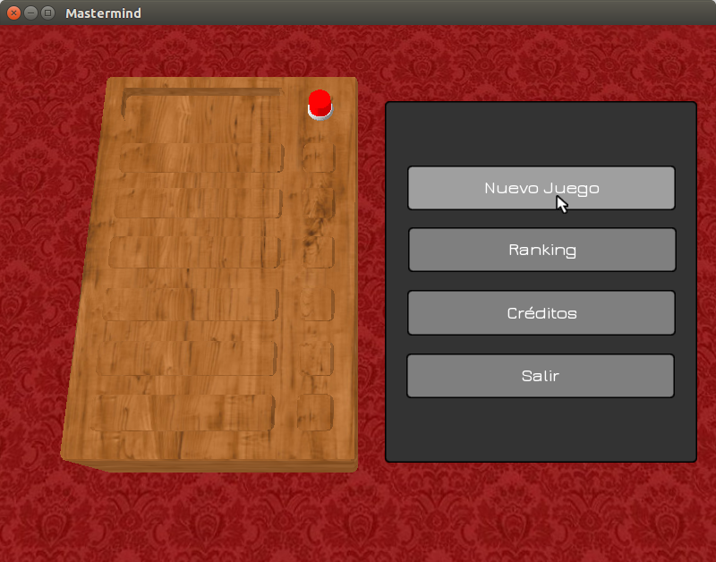

# Mastermind

GNU/Linux minigame developed by means of [Ogre 1.9](http://www.ogre3d.org/), [CEGUI](http://cegui.org.uk/) and [CEED](http://cegui.org.uk/wiki/CEED).

## Authors
* José Juan Ramírez de Arellano Díaz Miguel
* Pedro Manuel Gómez-Portillo López

## Screenshots

## License

This program and its files are distributed under the [MIT License](LICENSE.txt). 
